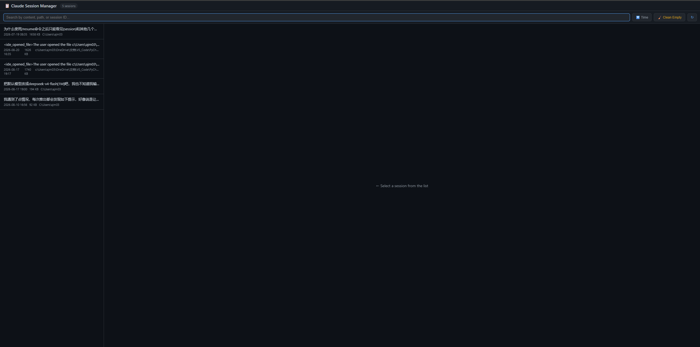

# Claude Session Manager

A lightweight GUI tool to **browse, preview, export, migrate, and delete** your Claude Code conversations — across **all projects**, not just the current directory.

Built with pure Python standard library — **zero dependencies**. No Node, no Electron, no installation hassle.


---

## Why?

Claude Code's built-in `/resume` only shows sessions from the **current project directory**. If you've worked in multiple directories (different repos, different folders), your conversations are scattered across `~/.claude/projects/*/` and invisible to `/resume`.

This tool gives you a single pane of glass over all of them.

| Feature | `/resume` | `claude project purge` | **This tool** |
|---|---|---|---|
| Cross-project session list | ❌ | ❌ | ✅ |
| Preview conversation content | ❌ | ❌ | ✅ |
| Delete individual sessions | ❌ | ❌ | ✅ |
| Migrate session to another project | ❌ | ❌ | ✅ |
| Export to text file | ❌ | ❌ | ✅ |
| One-click clean empty sessions | ❌ | ❌ | ✅ |
| Delete ALL sessions of a project | ❌ | ✅ | ❌ |

---

## Features

- 🔍 **Cross-project browsing** — see every session across all your Claude Code project directories
- 💬 **Live preview** — click any session to read the full conversation (user vs assistant messages color-coded)
- 📥 **Export** — download any conversation as a readable `.txt` file
- 📁 **Migrate** — move a session to a different project directory
- 🗑 **Delete** — remove individual sessions (with confirmation)
- 🧹 **Clean empty** — one-click purge of "zombie" sessions (launched but never typed a message)
- 🔎 **Search & sort** — filter by content, path, or session ID; sort by time

---

## Installation

### Option 1: pip (recommended)

```bash
pip install git+https://github.com/JmAN-2003/claude-session-manager.git

# Then launch anywhere:
claude-session-manager
```

### Option 2: Clone & run directly

```bash
git clone https://github.com/JmAN-2003/claude-session-manager.git
cd claude-session-manager
python claude_session_manager.py
```

### Option 3: Editable install (for development)

```bash
git clone https://github.com/JmAN-2003/claude-session-manager.git
cd claude-session-manager
pip install -e .
claude-session-manager
```

---

## Usage

Run the tool:

```bash
claude-session-manager
```

Your browser opens automatically at `http://localhost:8899`. If the port is busy, it automatically picks the next available one.

### Options

```
usage: claude-session-manager [-h] [--port PORT] [--no-browser]

optional arguments:
  --port PORT      Port to run the web server on (default: 8899).
                   If busy, the next available port is used.
  --no-browser     Do not auto-open a browser window.
```

Example:

```bash
claude-session-manager --port 9000 --no-browser
```

### Screenshot



---

## How it works

- Reads session transcripts from `~/.claude/projects/*/*.jsonl` (the same files Claude Code itself uses)
- Serves a self-contained HTML/JS frontend over a local HTTP server bound to `127.0.0.1`
- All operations (delete, migrate) manipulate those files directly

> ⚠️ **Works on Windows, macOS, and Linux.** The tool uses `os.path.expanduser("~")` to locate your `.claude` directory, and the project-path encoding handles both `\` and `/` separators.

---

## Safety

- 🔒 **100% local** — the server binds to `127.0.0.1` only. No data ever leaves your machine.
- ⚠️ **Delete is permanent** — deleted sessions cannot be recovered. The tool always asks for confirmation first.
- 📄 **Migration moves files** — be careful when moving a session out of a project directory you're actively using; it will no longer appear in `/resume` for that directory.

---

## FAQ

**Q: What is an "empty session"?**
Claude Code creates a session file the moment you launch `claude`. If you close it without typing anything, a ~7 KB "zombie" session is left behind. The **Clean Empty** button deletes all of these at once.

**Q: I have sessions from the VS Code extension too — are they included?**
Yes. The VS Code extension stores sessions in the same `~/.claude/projects/` directory, just under a different subfolder per project. They all show up here.

**Q: Why don't I see a session I know exists?**
Check that it's in `~/.claude/projects/`. Older Claude Code versions stored sessions differently, and some very old sessions may live elsewhere.

**Q: Can I rename a session?**
Not yet — this is a roadmap item. Sessions are identified by their UUID, and renaming would require editing internal metadata.

---

## Roadmap

- [ ] Rename sessions
- [ ] Fuzzy search across full conversation content
- [ ] Backup / restore sessions as archives
- [ ] Tag & favorite important sessions

---

## Contributing

PRs welcome! This is a single-file tool — open an issue or PR on [GitHub](https://github.com/JmAN-2003/claude-session-manager).

---

## License

[MIT](LICENSE) © 2026 JmAN-2003
